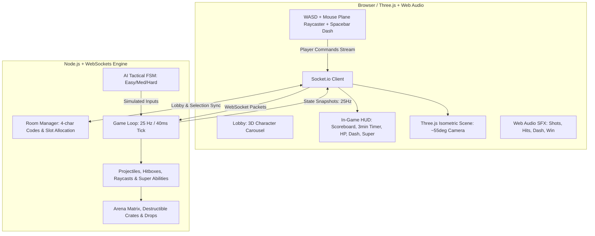

# TechSpec Master — Arquitetura de Sistema
**Status:** Aprovado via Grill-Me  
**Versão:** 2.0.0  

---

## 1. Visão Geral da Arquitetura
A arquitetura do **Mini Brawl 3D** é projetada no modelo **Client-Server com Autoridade Centralizada Híbrida**.

---

## 2. Pilha Tecnológica (Tech Stack)

| Componente | Tecnologia | Papel |
| :--- | :--- | :--- |
| **Engine Gráfica** | Three.js (r160+) | Renderização WebGL, iluminação com sombras, materiais estilizados e carregamento de modelos `.glb`. |
| **Frontend UI** | HTML5 / CSS3 moderno | Interfaces de Lobby, seletor de armas, HUD de vida/dash/super e modal de respawn sem dependências pesadas. |
| **Áudio** | Web Audio API | Efeitos sonoros espaciais de tiros, impactos, dash, explosões e fanfarra final. |
| **Backend de Rede** | Node.js + Socket.io | Servidor autoritativo de sincronização de estado, gerenciador de salas e motor dos bots. |
| **Modelos 3D** | Kenney Mini Characters & Blaster Kit | Modelos low-poly otimizados em formato binário `.glb`. |

---

## 3. Topologia e Coordenadas do Mundo 3D
* **Origem:** O centro da arena é $(X=0, Z=0)$.
* **Plano de Movimento:** Eixos $X$ (horizontal) e $Z$ (profundidade). Chão em $Y=0$.
* **Câmera Isométrica:**
  - Posição: $(X=0, Y=24, Z=20)$
  - Rotação: Ângulo fixo de $55^\circ$ direcionado para o centro da arena ou com *lerp* suave acompanhando o jogador local.
  - FOV: $45^\circ$ (Perspectiva com distorção mínima para emular visão isométrica limpa).

---

## 4. Tick Rate e Sincronização
* O servidor processa o loop de jogo a **25 Hz** (1 tick a cada 40 milissegundos).
* A cada tick, o servidor:
  1. Processa comandos de movimento e disparos recebidos.
  2. Atualiza a física de projéteis e detecta colisões com jogadores e caixas.
  3. Atualiza a máquina de estados dos bots de IA.
  4. Gerencia os cronômetros de respawn de jogadores e de caixas.
  5. Envia o pacote de snapshot `GAME_TICK` para todos os clientes da sala.
* O cliente usa **Interpolação Linear (LERP)** para suavizar as posições dos demais jogadores a 60 FPS.
