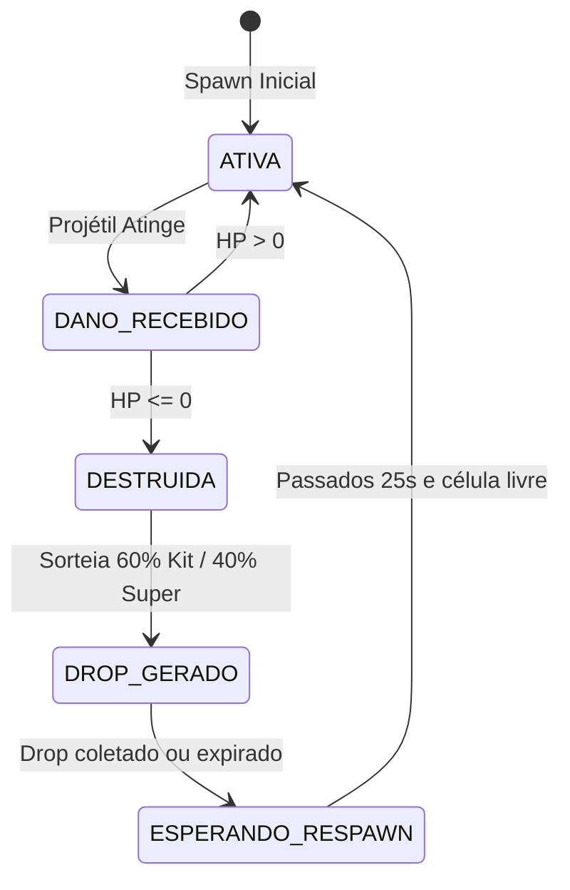

# TechSpec — Módulo 02: Arena 3D, Câmera e Elementos do Cenário
**Status:** Aprovado via Grill-Me  
**Versão:** 2.0.0  

---

## 1. Topologia da Arena e Matriz de Obstáculos
A arena é modelada em um grid simétrico de **$36 \times 36$ metros** centralizado em $(0,0,0)$.

```text
[P1 Spawn] ------------ [Paredes Centrais] ------------ [P2 Spawn]
     |                        [Caixas]                       |
     |                       [Kits/Drops]                    |
[P3 Spawn] ------------ [Paredes Centrais] ------------ [P4 Spawn]
```

### Matriz de Definição do Mapa (`specs/arena-map.json`)
```json
{
  "dimensions": { "width": 36, "depth": 36 },
  "spawns": [
    { "index": 0, "x": -14, "z": -14 },
    { "index": 1, "x": 14, "z": -14 },
    { "index": 2, "x": -14, "z": 14 },
    { "index": 3, "x": 14, "z": 14 }
  ],
  "solidWalls": [
    { "x": -6, "z": 0, "width": 2, "depth": 6, "height": 2.2 },
    { "x": 6, "z": 0, "width": 2, "depth": 6, "height": 2.2 },
    { "x": 0, "z": -6, "width": 6, "depth": 2, "height": 2.2 },
    { "x": 0, "z": 6, "width": 6, "depth": 2, "height": 2.2 }
  ],
  "destructibleCrates": [
    { "id": "crate_01", "x": -3, "z": -3, "hp": 240, "respawnCooldownSec": 25 },
    { "id": "crate_02", "x": 3, "z": -3, "hp": 240, "respawnCooldownSec": 25 },
    { "id": "crate_03", "x": -3, "z": 3, "hp": 240, "respawnCooldownSec": 25 },
    { "id": "crate_04", "x": 3, "z": 3, "hp": 240, "respawnCooldownSec": 25 },
    { "id": "crate_05", "x": 0, "z": 0, "hp": 300, "respawnCooldownSec": 30 }
  ]
}
```

---

## 2. Sistema de Colisão AABB (Axis-Aligned Bounding Box)
A colisão de movimento do jogador e detecção de acerto de projéteis contra paredes e caixas é executada no backend de forma analítica rápida:

```javascript
function checkAABBCollision(boxA, boxB) {
  return (
    Math.abs(boxA.x - boxB.x) * 2 < (boxA.width + boxB.width) &&
    Math.abs(boxA.z - boxB.z) * 2 < (boxA.depth + boxB.depth)
  );
}
```

---

## 3. Máquina de Estados da Caixa Destrutível



---

## 4. Configuração da Câmera Isométrica no Three.js

```javascript
function setupIsometricCamera(aspectRatio) {
  const camera = new THREE.PerspectiveCamera(45, aspectRatio, 0.1, 1000);
  
  // Posição elevada e inclinada a 55 graus
  camera.position.set(0, 24, 20);
  camera.lookAt(0, 0, 0);
  
  return camera;
}
```
* A iluminação utiliza um `DirectionalLight` suave gerando sombras projetadas no plano do chão (`castShadow = true`), reproduzindo a estética limpa do Kenney Kit.


---

## 4. Visual Overhaul & Interactive Props Specification

### 4.1 Stadium Corner Floodlights (Torres de Iluminação)
- **Estrutura:** Postes metálicos cilíndricos de $7\text{m}$ de altura nos 4 cantos da arena.
- **Luminárias:** `THREE.SpotLight` voltados para o centro da arena com temperatura de cor de $3200\text{K}$ (`#fff3cc`), conferindo aspecto esportivo e noturno à arena.

### 4.2 Scorch Mark Decals (Marcas de Queimadura)
- **Comportamento:** Ao ocorrer uma explosão (granada, barril ou míssil nuclear), um decalque circular (`THREE.CircleGeometry`) é projetado no chão a $Y=0.03$.
- **Tempo de Vida:** Decai suavemente ao longo de $12\text{s}$ reduzindo opacidade de $0.75$ a $0.0$.
