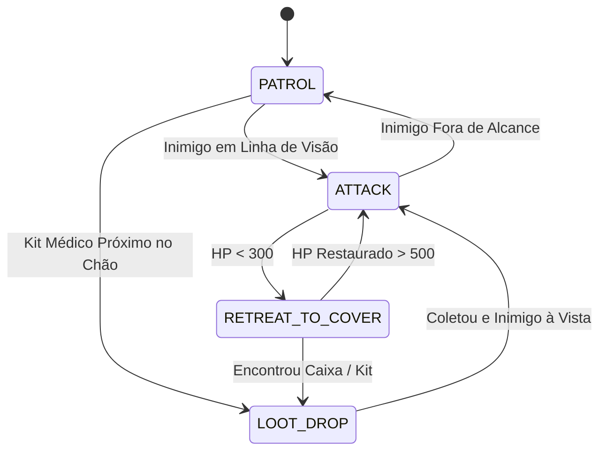

# TechSpec — Módulo 05: Bots de Inteligência Artificial da Arena
**Status:** Aprovado via Grill-Me  
**Versão:** 2.0.0  

---

## 1. Máquina de Estados Finita (FSM) dos Bots

---

## 2. Algoritmo de Mira Preditiva (Dificuldade Difícil)

Para acertar jogadores em movimento, o bot com dificuldade `hard` calcula o ponto futuro de impacto considerando a velocidade do projétil $V_p$ e a velocidade do jogador alvo $\vec{V}_t$:

$$\vec{P}_{\text{mira}} = \vec{P}_{\text{alvo}} + \vec{V}_t \cdot \left(\frac{\|\vec{P}_{\text{alvo}} - \vec{P}_{\text{bot}}\|}{V_p}\right)$$

---

## 3. Algoritmo de Desvio de Projéteis com Dash (Evasão Ativa)

No modo `hard`, a cada tick do servidor:
1. O bot itera sobre todos os projéteis ativos na arena que não pertencem a ele.
2. Calcula a distância perpendicular entre a trajetória do projétil e sua própria posição.
3. Se a distância de colisão for menor que $1.2\text{m}$ e o tempo de impacto for inferior a $250\text{ms}$:
   - Aciona o **Dash de Esquiva** em um ângulo perpendicular de $90^\circ$ em relação à trajetória do projétil, saindo da linha de fogo.

---

## 4. Integração dos Bots com o Game Loop
Os bots são simulados diretamente no **Node.js** (backend autoritativo). Eles não utilizam WebSockets externos; em vez disso, suas decisões geram comandos idênticos aos de jogadores reais injetados no buffer do `TickEngine` a 25 Hz. Isso garante que as regras de colisão, velocidade e recarga sejam 100% justas e iguais para humanos e bots.

---

## 5. Revisão de Calibração e Humanização dos Bots (v2.0)

Para evitar comportamento de "aimbot perfeito" e garantir jogabilidade divertida e competitiva, os parâmetros foram refinados com dispersão estocástica e atrasos de reação:

### 5.1 Dispersão de Mira Humana (Jitter Estocástico)
A mira dos bots recebe perturbação gaussiana proporcional ao nível de dificuldade:
$$\vec{P}_{\text{mira}} = \vec{P}_{\text{alvo}} + \begin{pmatrix} (\sin(0.003 \cdot t) \cdot 0.8 + \text{rand}_{[-0.5, 0.5]}) \cdot E \\ (\cos(0.003 \cdot t) \cdot 0.8 + \text{rand}_{[-0.5, 0.5]}) \cdot E \end{pmatrix}$$

Onde o fator de erro $E$ é:
* **Fácil:** $E = 2.8\text{m}$ (erro acentuado a médias/longas distâncias).
* **Médio:** $E = 1.4\text{m}$ (desvios moderados).
* **Difícil:** $E = 0.6\text{m}$ (preciso, porém não perfeito).

### 5.2 Cadência e Hesitação de Disparo
* **Fácil:** Intervalo mínimo de $1200\text{ms}$ entre tiros.
* **Médio:** Intervalo mínimo de $850\text{ms}$.
* **Difícil:** Intervalo mínimo de $600\text{ms}$.

### 5.3 Verificação de Linha de Visão (Line of Sight Raycast)
Antes de disparar, o bot verifica a intersecção de segmento de reta com as coordenadas AABB das paredes sólidas da arena. Se houver obstrução geométrica, o disparo é cancelado e o bot transiciona para `PATROL` ou manobra de flanqueamento.
